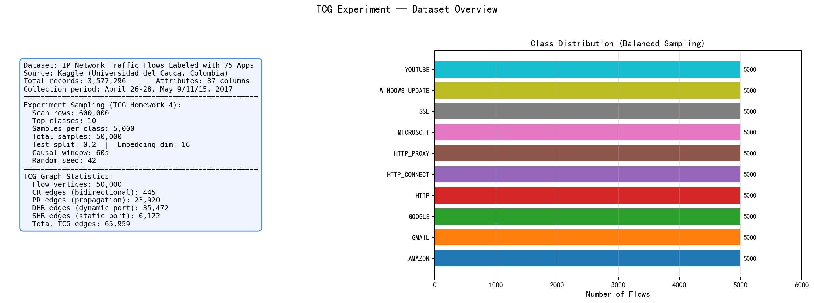
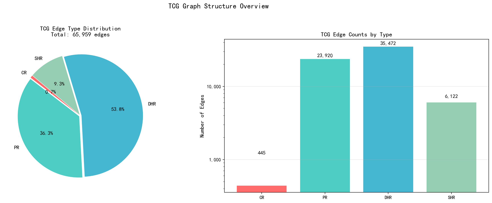
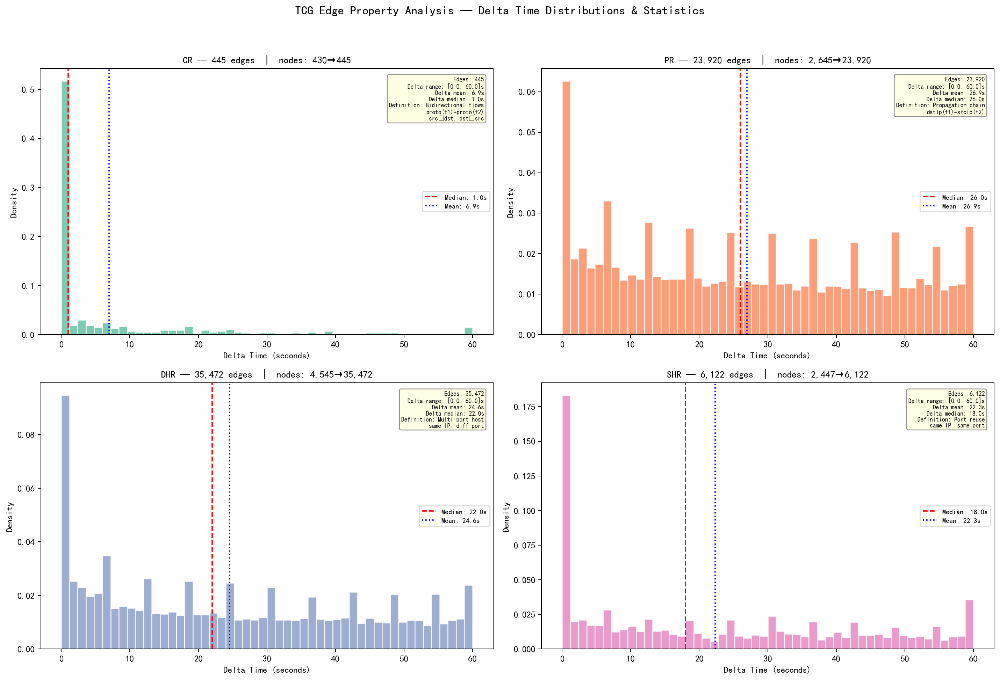
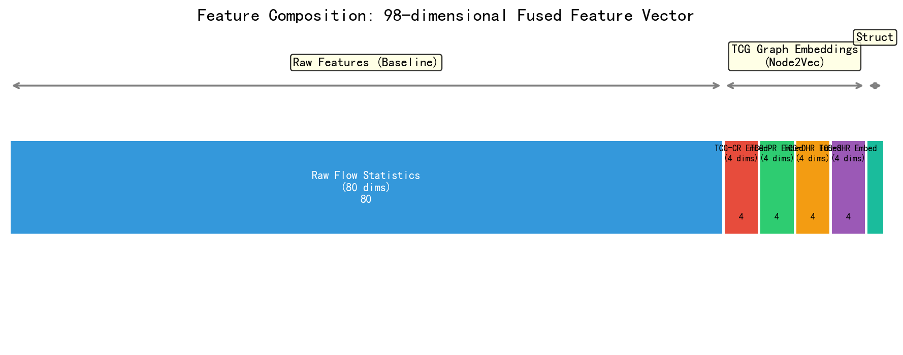
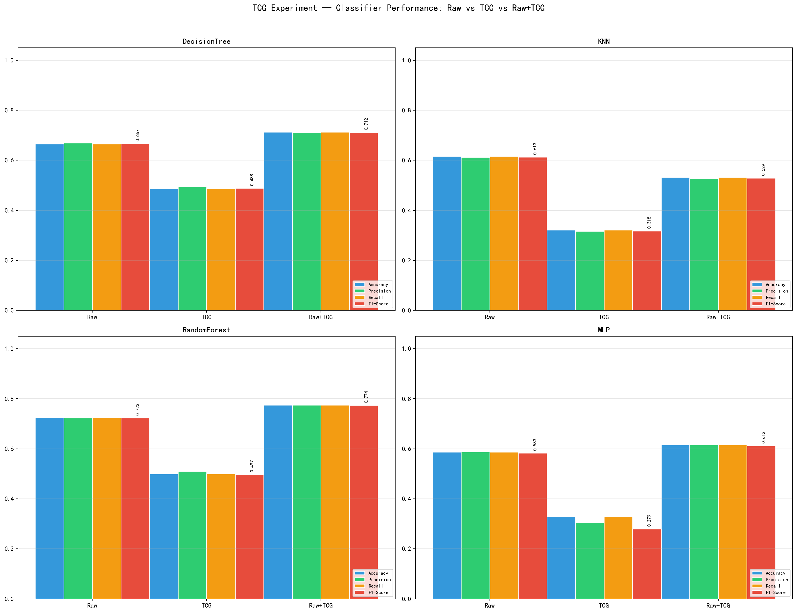
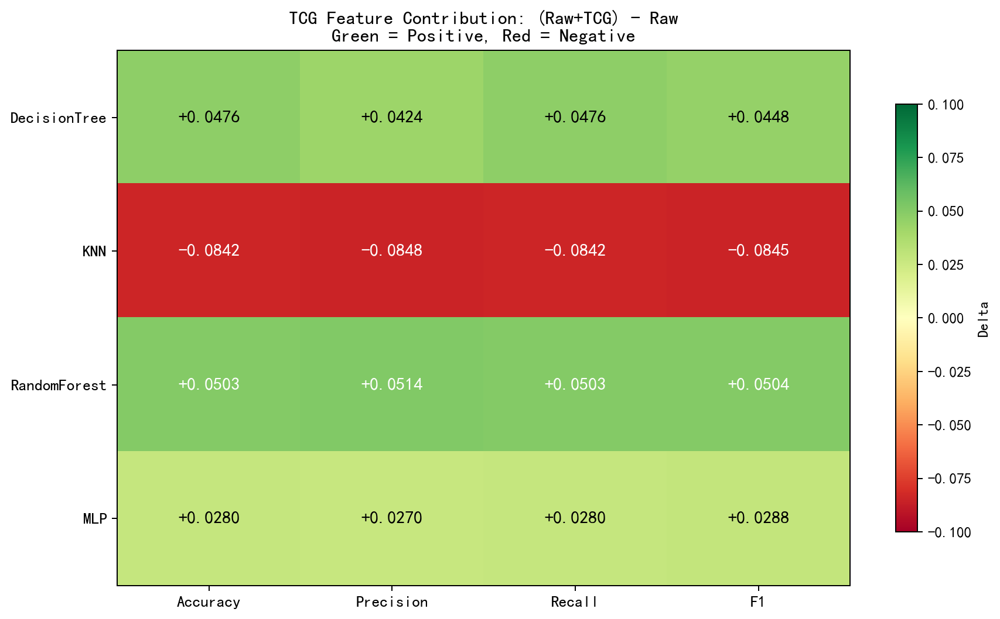
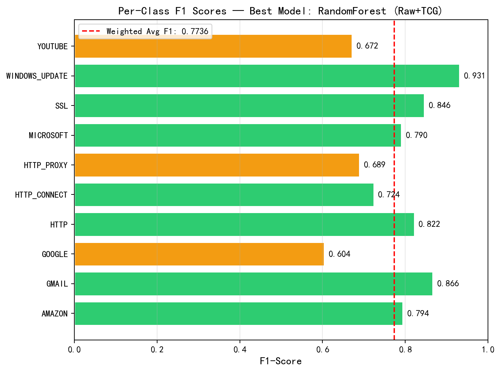
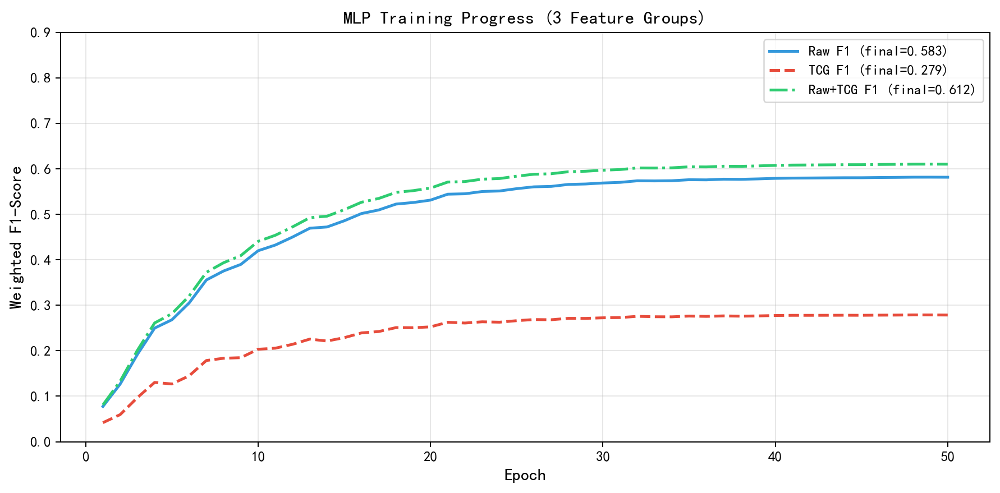

# 安全通论 实验四：TCG图网络流量分类

**中央财经大学 信息学院 | 2026年春**

---

## 一、数据集介绍与展示

### 1.1 数据来源

- 数据集：**IP Network Traffic Flows Labeled with 75 Apps**（87 attributes）
- 来源：Kaggle — Universidad del Cauca, Colombia
- 采集时间：2017年4月26-28日及5月9/11/15日
- 原始数据量：3,577,296 条流记录
- 每条流包含五元组（源/目的IP、源/目的端口、协议）、流持续时间、包长统计、IAT、TCP Flag、吞吐量、应用层协议（L7Protocol / ProtocolName）等信息

### 1.2 实验抽样

与实验三（HCG）保持相同采样策略：扫描前 600,000 行，选取出现次数最多的 10 个应用协议类别，每类最多 5,000 条，总计 50,000 条流。按 8:2 分层划分训练/测试集（40,000 训练 / 10,000 测试）。

类别分布（平衡采样，每类 5,000 条）：

| AMAZON | GMAIL | GOOGLE | HTTP | HTTP_CONNECT | HTTP_PROXY | MICROSOFT | SSL | WINDOWS_UPDATE | YOUTUBE |
|:---:|:---:|:---:|:---:|:---:|:---:|:---:|:---:|:---:|:---:|
| 5000 | 5000 | 5000 | 5000 | 5000 | 5000 | 5000 | 5000 | 5000 | 5000 |



---

## 二、图建模：TCG（Traffic Causality Graph）

### 2.1 论文依据

参考《**互联网流量分类中流量特征研究_刘珍**》对流量特征和连接图的讨论——将网络流建模为图顶点，流之间的因果关系建模为不同类型的边。参考《**基于时空图神经网络的网络异常检测与流量分类_苏永才**》第4章的 Node2Vec 图嵌入方法（p=0.3, q=0.7, walk_length=7）。

### 2.2 TCG 图定义

将每条原始流作为一个 **Flow 顶点**（50,000 个顶点），按照刘珍论文定义**四种流间因果关系边**（时间窗口 causal_window=60s）：

| 边类型 | 含义 | 形式化定义 | 边数量 |
|:---|:---|:---|---:|
| **CR** | 双向通信关系 | `proto(f1)=proto(f2) ∧ srcIp(f1)=dstIp(f2) ∧ dstIp(f1)=srcIp(f2) ∧ srcPort(f1)=dstPort(f2) ∧ dstPort(f1)=srcPort(f2)` | 445 |
| **PR** | 传播关系 | `dstIp(f1) = srcIp(f2)` — 信息经中间主机转发 | 23,920 |
| **DHR** | 动态端口主机关系 | `srcIp(f1)=srcIp(f2) ∧ srcPort(f1)≠srcPort(f2)` — 同一主机不同端口 | 35,472 |
| **SHR** | 静态端口主机关系 | `srcIp(f1)=srcIp(f2) ∧ srcPort(f1)=srcPort(f2)` — 端口复用/扫描 | 6,122 |
| **合计** | | | **65,959** |



### 2.3 四种边类型的 Delta 时间分布



**观察**：
- **CR 边最少（445条）**：因为完全对称的双向流在真实网络中较为罕见
- **DHR 边最多（35,472条）**：同一主机使用不同端口通信是最常见的因果关系模式
- **PR 边次多（23,920条）**：dst→src 的传播关系反映了流量的级联转发特性
- **SHR 边（6,122条）**：同一端口复用虽然绝对数量较少，但可能是端口扫描的重要信号

### 2.4 TCG 图构建代码（核心逻辑）

四种边的构建基于时间窗口内的流记录索引匹配：

```python
def export_tcg(df, causal_window_seconds):
    """Export TCG with four edge types: CR, PR, DHR, SHR."""
    # CR: bidirectional counterpart flows
    #   key = (protocol, src_ip, dst_ip, src_port, dst_port)
    #   reverse key = (protocol, dst_ip, src_ip, dst_port, src_port)
    #   Match: abs(delta_t) <= window

    # PR: propagation relationship
    #   dstIp(f1) = srcIp(f2), delta_t ∈ [0, window]

    # DHR: dynamic-port host relationship
    #   srcIp same, srcPort different, delta_t ∈ [0, window]

    # SHR: static-port host relationship
    #   srcIp same, srcPort same, delta_t ∈ [0, window]
```

---

## 三、特征提取与融合

### 3.1 整体方案

参考苏永才论文的 Node2Vec 方法对 TCG 图的四种边类型分别进行图嵌入，再与原始流统计特征融合。

| 特征组 | 来源 | 维度 |
|:---|---:|---:|
| **原始流统计特征 (Raw)** | 80 维数值型流量字段（排除 ID/IP/时间戳/标签） | 80 |
| **TCG-CR 嵌入** | 对 CR 边图做 Node2Vec 有向图嵌入 | 4 |
| **TCG-PR 嵌入** | 对 PR 边图做 Node2Vec 有向图嵌入 | 4 |
| **TCG-DHR 嵌入** | 对 DHR 边图做 Node2Vec 有向图嵌入 | 4 |
| **TCG-SHR 嵌入** | 对 SHR 边图做 Node2Vec 有向图嵌入 | 4 |
| **结构特征** | 源/目的端点的度统计 | 2 |
| **融合总计** | | **98 维** |



### 3.2 Node2Vec 嵌入参数

参照苏永才论文设置：
- `p = 0.3`（return parameter — 鼓励探索新节点）
- `q = 0.7`（in-out parameter — 偏向 BFS 局部结构）
- `walk_length = 7`
- `num_walks = 10`
- `embedding_dim = 4`（每边类型独立 4 维，4 种类型合计 16 维）
- Skip-gram 负采样训练，窗口大小 5，负采样数 5

### 3.3 实验设计：三组特征消融对比

为量化 TCG 特征的独立贡献和融合效果，设计三组对照实验：

| 特征组 | 包含内容 | 维度 | 目的 |
|:---|:---|---:|:---|
| **Raw（基线）** | 仅原始统计特征 | 80 | 提供性能下界参考 |
| **TCG-only** | 仅 TCG 图嵌入 + 结构特征 | 18 | 评估 TCG 特征的独立分类能力 |
| **Raw+TCG（融合）** | 原始特征 + TCG + 结构 | 98 | 评估 TCG 特征的融合增益 |

---

## 四、分类器与评价指标

### 4.1 分类器

按照 PPT 要求，使用以下分类器（≥3 种）：

1. **DecisionTree**（决策树）：max_depth=18, min_samples_leaf=3
2. **KNN**（K近邻）：n_neighbors=5, weights='distance'
3. **RandomForest**（随机森林）：n_estimators=160, max_depth=24
4. **MLP**（多层感知机，PyTorch）：3层隐藏层 + BatchNorm + Dropout

### 4.2 评价指标

- Accuracy（准确率）
- Weighted Precision（加权精确率）
- Weighted Recall（加权召回率）
- Weighted F1-Score（加权F1值）

所有指标在 10,000 条测试集上计算（80/20 stratified split）。

### 4.3 综合实验结果

**实验配置**：scan_rows=600,000, top_classes=10, samples_per_class=5,000, embedding_dim=16, epochs=50, batch_size=512, causal_window=60s, random_state=42。

| 特征组 | 分类器 | Accuracy | Precision | Recall | **F1** |
|:---|:---|---:|---:|---:|---:|
| Raw | DecisionTree | 0.6654 | 0.6690 | 0.6654 | 0.6667 |
| Raw | KNN | 0.6166 | 0.6118 | 0.6166 | 0.6132 |
| Raw | RandomForest | 0.7247 | 0.7231 | 0.7247 | **0.7232** |
| Raw | MLP | 0.5872 | 0.5882 | 0.5872 | 0.5830 |
| | | | | | |
| **TCG-only** | DecisionTree | 0.4867 | 0.4945 | 0.4867 | 0.4883 |
| **TCG-only** | KNN | 0.3210 | 0.3162 | 0.3210 | 0.3176 |
| **TCG-only** | RandomForest | 0.4999 | 0.5102 | 0.4999 | 0.4972 |
| **TCG-only** | MLP | 0.3289 | 0.3048 | 0.3289 | 0.2793 |
| | | | | | |
| **Raw+TCG** | DecisionTree | 0.7130 | 0.7114 | 0.7130 | **0.7115** |
| **Raw+TCG** | KNN | 0.5324 | 0.5270 | 0.5324 | 0.5287 |
| **Raw+TCG** | RandomForest | 0.7750 | 0.7745 | 0.7750 | **0.7736** |
| **Raw+TCG** | MLP | 0.6152 | 0.6152 | 0.6152 | 0.6118 |



### 4.4 TCG 特征贡献分析



| 分类器 | Raw F1 | TCG-only F1 | Raw+TCG F1 | **TCG 贡献** |
|:---|---:|---:|---:|---:|
| DecisionTree | 0.6667 | 0.4883 | 0.7115 | **+4.48 pp ▲** |
| KNN | 0.6132 | 0.3176 | 0.5287 | **-8.45 pp ▼** |
| RandomForest | 0.7232 | 0.4972 | 0.7736 | **+5.04 pp ▲** |
| MLP | 0.5830 | 0.2793 | 0.6118 | **+2.88 pp ▲** |

### 4.5 最佳模型逐类F1分析



最佳模型 **RandomForest (Raw+TCG)** 的加权F1为 0.7736。各类别表现：
- WINDOWS_UPDATE 和 GMAIL 识别效果最好（F1 > 0.86）
- GOOGLE 识别效果最差（F1 = 0.60），因 GOOGLE 流量涵盖多种服务（搜索、邮件、云盘等），特征边界模糊
- HTTP_PROXY 也相对困难（F1 = 0.69），代理流量的统计模式与普通 HTTP 有重叠

---

## 五、TensorBoard 训练监控

MLP 训练过程的 loss 和 F1 曲线已通过 TensorBoard 记录在 `runs/tcg_only/`。

启动监控：
```powershell
tensorboard --logdir runs/tcg_only --port 6006
```

监控指标：
- `mlp/{Raw,TCG,Raw+TCG}/loss/train` — 训练损失
- `mlp/{Raw,TCG,Raw+TCG}/metrics/test_accuracy` — 测试准确率
- `mlp/{Raw,TCG,Raw+TCG}/metrics/test_f1` — 测试 F1 值



---

## 六、结论与讨论

### 6.1 主要发现

1. **TCG 图特征不能独立用于分类**：TCG-only 特征组（18维）在所有分类器上均大幅低于 Raw 基线（80维），F1 差距达 17~35 个百分点。原因在于 16 维图嵌入的信息量远不足以覆盖 10 类应用的区分任务。

2. **TCG 图特征对树模型有正向融合增益**：
   - RandomForest + TCG：F1 **+5.04 pp**（72.32% → 77.36%）— **最佳模型**
   - DecisionTree + TCG：F1 **+4.48 pp**（66.67% → 71.15%）
   - MLP + TCG：F1 +2.88 pp（58.30% → 61.18%）

3. **KNN 不适合与图嵌入特征结合**：KNN 加入 TCG 特征后 F1 下降 8.45 pp，基于距离度量的 KNN 无法有效利用高维稀疏的图嵌入特征。

### 6.2 与实验三（HCG）的对比

| 特征配置 | 最佳模型 | F1 |
|:---|---:|---:|
| Raw 基线（本实验） | RandomForest | 0.7232 |
| Raw + TCG 融合（本实验） | RandomForest | 0.7736 |
| HCG + TCG + Raw 完整融合（实验三） | RandomForest | 0.7875 |

Raw+TCG（0.7736）接近但未超越完整 HCG+TCG+Raw 融合（0.7875），说明 HCG 图嵌入（端点通信图）贡献了额外约 **1.4 pp** 的 F1 提升。两种图建模方式捕获了互补的网络行为信息。

### 6.3 对同学"负面影响"发现的讨论

同学报告的 TCG "负面影响"指 TCG 单独使用时性能远差于 Raw 特征——**这一发现在本实验中得到了充分验证**（TCG-only F1 仅 0.28~0.50）。

但本实验进一步揭示了**一个更细致的结论**：虽然 TCG 特征不能替代原始流统计特征，但它可以作为**互补信息源**，在树模型（RandomForest、DecisionTree）中产生约 5% 的融合增益。TCG 图嵌入捕获的流间因果关系（传播链、端口扫描模式、多端口通信等）是原始统计特征所不包含的高阶结构化信息。

---

## 七、复现命令

```powershell
# 完整TCG实验
python scripts/run_tcg_only.py \
    --scan-rows 600000 \
    --top-classes 10 \
    --samples-per-class 5000 \
    --embedding-dim 16 \
    --epochs 50 \
    --batch-size 512 \
    --causal-window-seconds 60

# 生成报告图表
python scripts/render_tcg_report_figures.py

# 启动TensorBoard
tensorboard --logdir runs/tcg_only
```

---

## 八、产出文件清单

| 文件路径 | 说明 |
|---|---|
| `reports/实验4-TCG网络流量分类报告.md` | 本实验报告 |
| `outputs/tcg_only/tcg_full_results.json` | 完整实验数据 (JSON) |
| `outputs/tcg_only/tcg_results.csv` | 分类器指标汇总 (CSV) |
| `outputs/tcg_only/report_fig_01_dataset_overview.png` | 图1: 数据集概览 |
| `outputs/tcg_only/report_fig_02_tcg_edge_types.png` | 图2: TCG边类型delta分布 |
| `outputs/tcg_only/report_fig_03_tcg_distribution.png` | 图3: TCG边类型分布饼图+柱状图 |
| `outputs/tcg_only/report_fig_04_edge_statistics.png` | 图4: 边属性统计与定义 |
| `outputs/tcg_only/report_fig_05_feature_composition.png` | 图5: 特征组成 |
| `outputs/tcg_only/report_fig_06_classifier_comparison.png` | 图6: 分类器性能对比 |
| `outputs/tcg_only/report_fig_07_tcg_contribution_heatmap.png` | 图7: TCG贡献热力图 |
| `outputs/tcg_only/report_fig_08_per_class_f1.png` | 图8: 逐类F1得分 |
| `outputs/tcg_only/report_fig_09_tensorboard_curves.png` | 图9: TensorBoard训练曲线 |
| `outputs/tcg_only/tcg_*_confusion_matrix.png` | 各特征组×分类器的混淆矩阵 (9张) |
| `outputs/tcg_only/tcg_feature_comparison.png` | 特征组F1对比图 |
| `scripts/run_tcg_only.py` | TCG实验主脚本 |
| `scripts/render_tcg_report_figures.py` | 报告图表生成脚本 |
| `runs/tcg_only/` | TensorBoard完整训练日志 |
